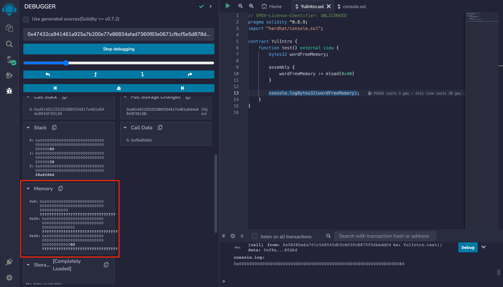
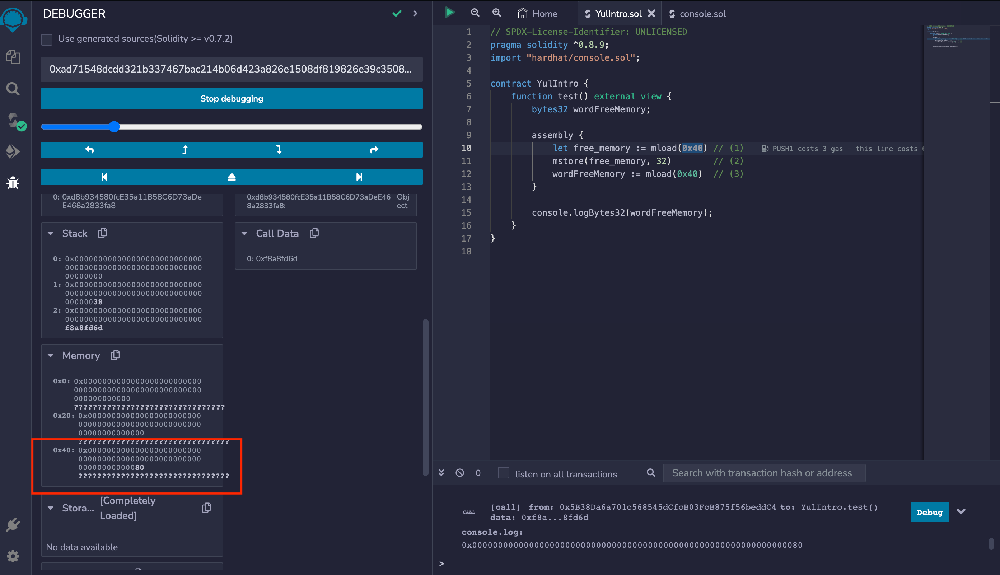
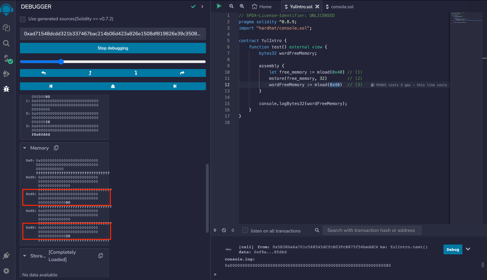
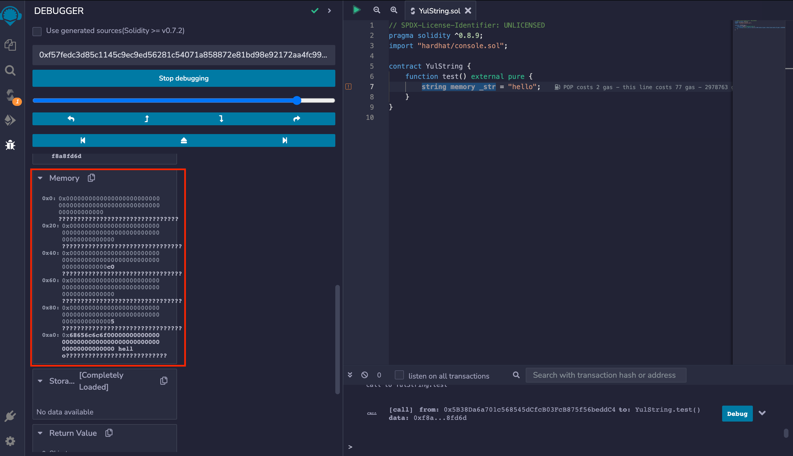

# YUL

Yul is a programming language that can be used to interact with the low level memory, stack in solidity. Yul is very handy during the smart contract audit and yul can be used to implement various types of functions that are hard to implement in solidity.

## Memory Structure

Memory layout in solidity

```sh
(Each word contains 32 bytes)
0x00 -> 0x1F = [0x00000000000000000000000000000000]
0x20 -> 0x3F = [0x00000000000000000000000000000000]
.
.
.
.
so on......
```

## Some important pointers

- Memory ranging from `0x00 -> 0x3F` is known as scratch memory.

`Scratch Memory` : It is the memory that is used to store the values during function execution.

```sh
          ---|
0x00 -> 0x1F |
0x20 -> 0x3F |-> Scratch Memory
          ---|
```

- Memory ranging from `0x40 -> 0x5F` store the free memory pointer.

`Free Memory Pointer` : It is a pointer that store the address in the memory that is empty and we can store anything on it.

```sh
          ---|
0x40 -> 0x5F |-> Free Memory Pointer
          ---|

0x40 -> 0x5F = [0x00000000000000000000000000000080]
```

Here in this example it is shown that `0x80` is the starting address of the memory that is available for storing anything.

## How variables are accessed through the memory (memory arch) ?

```ts
contract YulIntro {
    function test() external view {
        bytes32 wordFreeMemory;

        assembly {
            wordFreeMemory := mload(0x40)
        }

        console.logBytes32(wordFreeMemory);
    }
}

// OUTPUT : 0x0000000000000000000000000000000000000000000000000000000000000080
```

If we execute the `test()` function the state of memory will be as follows :

</img>

## Basic Code

- Here in this test() function it is shown that how to load the value from memory and store it into other variable, and storing the data into free_memory

  - `mload` : Loading the value from the memory address : mload(memory_address)
  - `mstore` : Storing the value into an address : mstore(memory_address, value)

```ts
contract YulIntro {
    function test() external view {
        bytes32 wordFreeMemory;

        assembly {
            let free_memory := mload(0x40) // (1)
            mstore(free_memory, 32)        // (2)
            wordFreeMemory := mload(0x40)  // (3)
        }

        console.logBytes32(wordFreeMemory);
        // OUTPUT : 0x0000000000000000000000000000000000000000000000000000000000000080
    }
}
```

Here there are three steps happening :

- `free_memory` pointer stores the pointer of the memory that is free.
- then `32` (0x20) is stores in the `free_memory` pointer in memory.
- Now the `wordFreeMemory` stores the pointer at memory location `0x40`.

The most important thing to notice is that the free memory pointer is not updated automatically while using YUL we need to do it manually.

**(1)**
</img>

**(2)**
</img>

## How strings are stored in memory ?

On the memory level the strings are stored as follows :

```ts
contract YulString {
    function test() external pure {
        string memory _str = "hello";
    }
}
```

</img>

If we take a look at the memory stack

- Here the length of the string is stored in the free memory pointer `0x80`.
- String is stored at `0xa0`.
